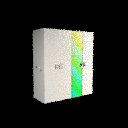
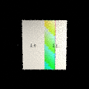
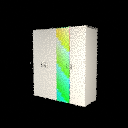

# Generative Video Ground Truth acceptance — Issue #6

## Issue #6 Round 2 — scoped video evidence closure

Closure instruction `6f68f7e59f490495c35f22f4d4aaeb266fd37d96` authorizes retaining frozen CODE `a5b368a3d907950c5165f4b1a0058853ace617fc` and exact CODE CI `34900852044` (901 tests per OS). The unchanged CODE and its manifests bind original implementation instruction `84a39b3ce5f4186fe0824fb66add1a9d1db720ef`; these are distinct, real instruction commits. The closure instruction was not falsely attributed to the frozen CODE checkout.

Clean REAL generation `d320a651-c2a4-403e-9322-a37630fcea6e`: HERO, ARTWORK_DETAIL and SMALL_ROOM, 288 frames / 1728 product controls + 120 independent room masks; Blender 5.2.1 LTS / OPTIX, usedMock=false, byte/matrix/mask/reopen/DAM lineage PASS. `videoGroundTruthReady`, `heroOrbitReal`, `artworkDetailReal`, `smallRoomReal` are true for this synthetic reference acceptance only. Durable candidate lineage is REAL_LOGIC: 19 runner cases plus 9 supplemental invocations of unchanged tracked adversarial tests against this generation's real ground-truth bytes PASS; candidate pixels remain FIXTURE_COPY/MOCK provider output. Details: [Round 2 acceptance](GENERATIVE_VIDEO_GROUND_TRUTH_ROUND2_ACCEPTANCE.md).

Visual inspection of first/middle/last confirms visible cabinet/artwork and distinct room context, with pronounced noise and bright surfaces. 128×128 preview quality and non-semantic QA remain PARTIAL; door/assembly authority, live H3/LTX/Vision, Final Commerce Video, physical UV/RIP/print/hot-folder/machines, Supervisor LIVE prerequisites and global Production Ready remain BLOCKED/false. Round 2 DOCS SHA/exact dual CI are recorded in the final Issue #6/#1 handoff after this document commit passes. No merge authorization.

Earlier scope-specific reports follow unchanged; no cabinet engineering truth or historical Supervisor prerequisite has been revalidated by this video run.

---

Instruction `8d54bb9bf1786ef8c9bbf7122cbb770927be5cda`. CODE `728e954af3312c8ad625e242918cbb029d0c1993`. CODE Actions [34887469718](https://github.com/netfox-web/blender-autonomous-3d/actions/runs/34887469718) exact Ubuntu + Windows SUCCESS, 858 tests per OS. Full local regression (`pytest -q -n 4`): 858 PASS; 71 new focused tests PASS. DOCS SHA/CI are supplied in the final Issue #6/#1 handoff after this document commit passes CI.

Clean REAL generation `e42c8575-56db-473a-bd28-d8353dc536cc` ran after CODE CI, on exact CODE with workingTreeClean=true, developmentOnly=false, usedMock=false. Blender 5.2.1 LTS / OPTIX, job `2ab14fea-ed07-47b2-b8dc-fe98bd20e3c4`. HERO_ORBIT_8S: 8 seconds, 12 fps, 128×128, 96 frames and 576 frame artifacts. All bytes/SHA/sizes, order/timestamps, camera/object matrices, artwork/geometry identities and DAM/job lineage verified. BLEND reopened at first/middle/last; persisted manifest reload PASS.

Authority seal: `d7fb6711b17b964488a66831c46b0a9f7d1208b503d39ba850f172addf989490`. Receipt seal: `347b37f58785949968a3f7e03a29e527e01d016ffa3ec73298c81f996473afff`. Manifest hash: `20fb394c69ef92160cea3923644245ab79d0a7602b47bc9cfab1bcc079a692d2`. Raw evidence: `.fox3d-work/video-e2e/e42c8575/`.

## Truth matrix

| Scope | Classification | Evidence / limitation |
|---|---|---|
| HERO control sequence and BLEND reopen | REAL | 96 actual Blender frames, 576 PNG/EXR controls, matrices, optics/lighting, byte/DAM lineage checks |
| Frozen authority, manifest, provider request contracts, QA/idempotency/retry/publication gates | REAL_LOGIC | Independent input derivation, 71 adversarial regressions, persisted reload and candidate gate execution |
| Source dimensions/artwork | FIXTURE | Synthetic 800×295×900 mm cabinet, four side-by-side doors, asymmetric generated art; not company measurements or the unmerged #4 Golden Product |
| Candidate | FIXTURE_COPY | Copied ground-truth pixels exercise PASS/REJECT and persistence only; no provider-generated pixels |
| CI Blender | MOCK | Regression evidence only |
| Detail / room recipes, quality and local DAM | PARTIAL | Plans/worker paths, no dedicated REAL sequence; low-resolution preview; persisted sealed descriptors with existing memory index |
| Door opening / assembly | BLOCKED | No independent hinge/component/pivot/axis/range/closed-open transform or assembly authority; no fabricated animation |
| Provider / Vision / physical print / machines / global readiness | BLOCKED | No live H3/LTX/Vision calls, UV/RIP calibration, hot-folder writes or LIVE CNC/LASER/PLC |

The fixture uses main's existing explicit size/location route before source Product Truth rendering and video rendering. Visual review found the legacy implicit cube route renders half-scale panels; that core helper was not changed, and its initial development renders are not the final evidence. Development runs and interrupted local test attempts are excluded from formal PASS counts.

## Actual frames (synthetic fixture)

  

`VIDEO_GROUND_TRUTH_READY=true` and `HERO_ORBIT_REAL=true` are scoped to this exact clean reference acceptance. `DOOR_OPEN_REAL=false`, `VISION_QA_READY=false`, `LIVE_H3_PROVIDER_READY=false`, `LIVE_LTX_PROVIDER_READY=false`, `GLOBAL_PRODUCTION_READY=false`. No merge authorization. STOP for Re-Gate after final DOCS CI and source Issue handoff.
