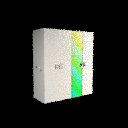
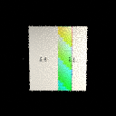
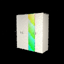
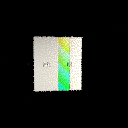
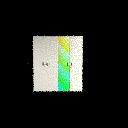
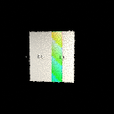
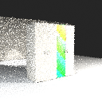
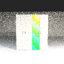
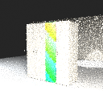

# Issue #6 Round 2 acceptance

Instruction `84a39b3ce5f4186fe0824fb66add1a9d1db720ef`; CODE `a5b368a3d907950c5165f4b1a0058853ace617fc`. Exact CODE [Actions 34900852044](https://github.com/netfox-web/blender-autonomous-3d/actions/runs/34900852044) Ubuntu + Windows SUCCESS, 901 tests/OS. Full local `pytest -q -n 4`: 901 PASS. Video-focused tests: 114, including 43 new Round 2 regressions. DOCS SHA and exact dual DOCS CI are recorded in the final Issue #6/#1 handoff after this document commit passes CI.

Clean exact-CODE REAL generation `d320a651-c2a4-403e-9322-a37630fcea6e`: workingTreeClean=true, developmentOnly=false, usedMock=false; Blender 5.2.1 LTS / OPTIX. All three sequences share frozen source Product Truth and artwork. 288 frames, 1728 product control artifacts plus 120 independent room masks. Actual SHA/size/matrices/masks/EXR/DAM/job lineage and persisted reload PASS. Durable acceptance executes 19 corruption/accepted-lock cases, rejects new attempts and preview/final publication on damaged history without new DAM writes, and verifies restart without an in-memory index.

| Sequence | Frames | Blender job | Actual first / middle / last |
|---|---:|---|---|
| HERO_ORBIT_8S | 96 | c4dbbfc9-eeaa-4e17-bd78-c1f726c4aa75 |    |
| ARTWORK_DETAIL_6S | 72 | 7b79658d-83ea-4817-857e-64b81559bce0 |    |
| SMALL_ROOM_10S | 120 | 56b93f73-d105-4c78-ab56-a75f60e6d980 |    |

## Truth matrix

| Classification | Scope |
|---|---|
| REAL | Clean HERO 8s/96 frames, ARTWORK_DETAIL 6s/72 frames, SMALL_ROOM 10s/120 frames; 12 fps, actual Blender/AOV/context outputs, BLEND reopen and persisted lineage |
| REAL_LOGIC | Verified prior-attempt set, strict durable assets, cache identity, no-write corruption guards, deterministic QA/retry/preview gates and blocked H3/LTX packages |
| FIXTURE | Synthetic 800×295×900 four-door cabinet and generated asymmetric art; no company measurements or unmerged Golden Product |
| MOCK / FIXTURE_COPY | CI Blender and copied candidate pixels; no provider-generated frames |
| PARTIAL | 128×128 control previews; deterministic QA cannot prove semantic Vision/hidden geometry; local persistence is not an OS trust boundary |
| BLOCKED | Door/assembly authority, live H3/LTX/Vision, Final Commerce Video, physical print/RIP/hot-folder/machines, Supervisor LIVE/global readiness |

Initial development runs are excluded: one HERO stalled before output; a later detail run rejected a cross-recipe cache hit. Per-pass progress and video-bound cache identity were corrected before final CODE. Prior Round 1 acceptance files retain their historical scope. No auto-merge; stop for external Re-Gate after final DOCS CI and handoff.

Raw local evidence: `.fox3d-work/video-round2-e2e/d320a651/`. Per-sequence authority/receipt/manifest hashes are in the machine-readable acceptance.

## Issue #6 Round 2 — scoped video evidence closure

Closure instruction `6f68f7e59f490495c35f22f4d4aaeb266fd37d96` authorizes retaining frozen CODE `a5b368a3d907950c5165f4b1a0058853ace617fc` and exact CODE CI `34900852044` (901 tests per OS). The unchanged CODE and its manifests bind original implementation instruction `84a39b3ce5f4186fe0824fb66add1a9d1db720ef`; these are distinct, real instruction commits. The closure instruction was not falsely attributed to the frozen CODE checkout.

Clean REAL generation `d320a651-c2a4-403e-9322-a37630fcea6e`: HERO, ARTWORK_DETAIL and SMALL_ROOM, 288 frames / 1728 product controls + 120 independent room masks; Blender 5.2.1 LTS / OPTIX, usedMock=false, byte/matrix/mask/reopen/DAM lineage PASS. `videoGroundTruthReady`, `heroOrbitReal`, `artworkDetailReal`, `smallRoomReal` are true for this synthetic reference acceptance only. Durable candidate lineage is REAL_LOGIC: 19 runner cases plus 9 supplemental invocations of unchanged tracked adversarial tests against this generation's real ground-truth bytes PASS; candidate pixels remain FIXTURE_COPY/MOCK provider output. Details: [Round 2 acceptance](GENERATIVE_VIDEO_GROUND_TRUTH_ROUND2_ACCEPTANCE.md).

Visual inspection of first/middle/last confirms visible cabinet/artwork and distinct room context, with pronounced noise and bright surfaces. 128×128 preview quality and non-semantic QA remain PARTIAL; door/assembly authority, live H3/LTX/Vision, Final Commerce Video, physical UV/RIP/print/hot-folder/machines, Supervisor LIVE prerequisites and global Production Ready remain BLOCKED/false. Round 2 DOCS SHA/exact dual CI are recorded in the final Issue #6/#1 handoff after this document commit passes. No merge authorization.

Earlier scope-specific reports follow unchanged; no cabinet engineering truth or historical Supervisor prerequisite has been revalidated by this video run.

Excluded formal attempts: [{"generationId": "d5d7140b-4b9a-420b-a75d-2c3be56ac3d3", "code": "a5b368a3d907950c5165f4b1a0058853ace617fc", "status": "FAILED_TIMEOUT", "lastProgress": "video_frame_0_depth", "completedBeautyFrames": 1, "rootCause": "UNDETERMINED; existing 120-second no-progress watchdog stopped worker; excluded from PASS."}]
