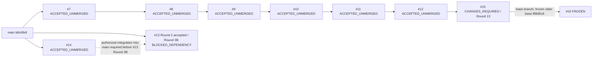

# Project completion inventory

Initial historical snapshot: 2026-09-27T07:03:11.535704+00:00; correction evidence checkpoint: 2026-09-27T07:32Z. This is a bounded inventory, not a production certification or an authorization to merge.

**PROJECT_STATUS: INDEPENDENT_FINAL_REVIEW_PENDING — PR #15 Round 13 correction CODE CI and clean REAL evidence completed.** Latest independent decision: [Supervisor 5853584739](https://github.com/netfox-web/blender-autonomous-3d/issues/1#issuecomment-5853584739). PR #16 is FROZEN; Round 14 is HOLD. `MERGE_AUTHORIZED=false`; `globalProductionReady=false`.

The original Worker corrected both reported defects on canonical CODE `2abcc3d817451d54a4ba6cd7793717745ad9bd43`. Exact dual-platform CODE CI and both fresh clean REAL chains completed. This immutable DOCS snapshot precedes its own exact CI and independent final decision; final DOCS identity and verdict are recorded in the Issue #1 handoff. A prior green run or a Worker READY_FOR_RE_GATE report does not supersede CHANGES_REQUIRED.

## Completion denominator and meaning

**8/10 = 80% historically accepted PR scopes** among PR #7–#16: #7–#14 have recorded scoped Supervisor acceptance; #15 current Round 13 is CHANGES_REQUIRED; #16 is frozen and unaccepted. PR #13 counts only its accepted Round 2; its Round 3B remains blocked. This measures historical acceptance coverage of these ten PR scopes, not percentage of product features, Issue completion, fresh independent acceptance, manufacturing readiness or production deployment. No combined all-project PASS is asserted.

Historical acceptance was independently reconciled against Issue #1 decisions, exact-head acceptance MD/JSON, CODE→DOCS file changes and fresh GitHub run/job responses. All sixteen PR #7–#14 CODE/DOCS runs match their expected SHA and report success on Ubuntu and Windows. Historical Blender artifacts were not rerendered or independently rehashed by this inventory audit. The separate PR #15 Supervisor did independently inspect existing raw artifacts as described below.

## Canonical refs and dependencies

- GitHub main: [`b8c6fe911e6c8358ed7bcdecafc84cab86630810`](https://github.com/netfox-web/blender-autonomous-3d/commit/b8c6fe911e6c8358ed7bcdecafc84cab86630810). The entry checkout is not assumed to be this canonical main.
- PR #15 reviewed HEAD: `6f1038c69e1586bdf6649596d603e64b21e9d73d`; reviewed CODE: `3bcd4214040779176d034f2a8113aedcae0e6dcd`; canonical branch `codex/product-variant-batches`, base `codex/model-category-tree`.
- PR #16 frozen HEAD: `d03041dedd9002c74e65dd3e5a0cbd096d9575ca`; its base ref names PR #15, but its recorded base SHA is the older `f88d5c896be424da54ab379cdd97a9dc35d08f90`, not the reviewed Round 13 HEAD.
- No PR #7–#16 HEAD is an ancestor of canonical main in this snapshot. #7–#14 are OPEN and non-draft; #15/#16 are OPEN/DRAFT. None is merged.

Solid arrows show target-branch dependencies, not completed merges. PR #13 and #14 each started directly from their own instruction-main commit; #14 is a semantic prerequisite for future #13 Round 3B, not its current Git base. The product lane and video lane have no authorized code-copy dependency.

| PR | Canonical base ref | Recorded exact base SHA | Canonical head ref | Exact HEAD at initial inventory |
|---|---|---|---|---|
| [#7](https://github.com/netfox-web/blender-autonomous-3d/pull/7) | `main` | `f43d80e5f7fcaa58ccebada2e1b95144ea7b89e0` | `codex/golden-three-tier` | `f65f264eb8083c08a55b9449acb1b3748eeb68e5` |
| [#8](https://github.com/netfox-web/blender-autonomous-3d/pull/8) | `codex/golden-three-tier` | `f65f264eb8083c08a55b9449acb1b3748eeb68e5` | `codex/artwork-print-workspace` | `f69adf912b183480f98c289211c4840323b70e8f` |
| [#9](https://github.com/netfox-web/blender-autonomous-3d/pull/9) | `codex/artwork-print-workspace` | `f69adf912b183480f98c289211c4840323b70e8f` | `codex/printfox-workbench-bridge` | `e0ea11fc33e5a336b2739ac7282688ff364bdaba` |
| [#10](https://github.com/netfox-web/blender-autonomous-3d/pull/10) | `codex/printfox-workbench-bridge` | `e0ea11fc33e5a336b2739ac7282688ff364bdaba` | `codex/nas-product-model-library` | `b479544853d635959820a3b23345485feed33867` |
| [#11](https://github.com/netfox-web/blender-autonomous-3d/pull/11) | `codex/nas-product-model-library` | `b479544853d635959820a3b23345485feed33867` | `codex/product-master-artwork-scenes` | `389f2fea2299039ab6d157fd22b77e0120d54896` |
| [#12](https://github.com/netfox-web/blender-autonomous-3d/pull/12) | `codex/product-master-artwork-scenes` | `389f2fea2299039ab6d157fd22b77e0120d54896` | `codex/model-category-tree` | `68f64d604bb750c0c48830c0d50516ef5157d296` |
| [#13](https://github.com/netfox-web/blender-autonomous-3d/pull/13) | `main` | `84a39b3ce5f4186fe0824fb66add1a9d1db720ef` | `codex/video-ground-truth` | `3c57849f2a765451a3c03c564bbe6346e26ea9cd` |
| [#14](https://github.com/netfox-web/blender-autonomous-3d/pull/14) | `main` | `4fb4f14a36e505255479397b905d18de13e1da8a` | `codex/articulation-authority-v1` | `40e6dd3c27beda0df6aaaaf80041685a813d553c` |
| [#15](https://github.com/netfox-web/blender-autonomous-3d/pull/15) | `codex/model-category-tree` | `68f64d604bb750c0c48830c0d50516ef5157d296` | `codex/product-variant-batches` | `6f1038c69e1586bdf6649596d603e64b21e9d73d` |
| [#16](https://github.com/netfox-web/blender-autonomous-3d/pull/16) | `codex/product-variant-batches` | `f88d5c896be424da54ab379cdd97a9dc35d08f90` | `codex/product-scene-library` | `d03041dedd9002c74e65dd3e5a0cbd096d9575ca` |

Base SHA values above are the recorded PR base snapshots, not assertions that canonical main equals each historical base. Changed target/head refs require a new inventory and integration review; this document does not authorize retargeting.

## Issue disposition

| Issue | Scope and canonical disposition | Current blocker |
|---|---|---|
| [#1](https://github.com/netfox-web/blender-autonomous-3d/issues/1) | Commander/Supervisor coordination and evidence authority | Round 13 correction and independent rereview outstanding; no merge/release authorization |
| [#4](https://github.com/netfox-web/blender-autonomous-3d/issues/4) | Golden 424×295×900 three-tier cabinet; PR #7 historically accepted scoped preview | Historical artwork and engineering/physical inputs incomplete; issue remains open |
| [#5](https://github.com/netfox-web/blender-autonomous-3d/issues/5) | Overlapping long-form video request; same title and substantially same requirements as #6 | No separate implementation or closure authorized; Owner/Supervisor duplicate disposition pending |
| [#6](https://github.com/netfox-web/blender-autonomous-3d/issues/6) | Canonical video execution lane established by Supervisor decisions [5660998477](https://github.com/netfox-web/blender-autonomous-3d/issues/1#issuecomment-5660998477) and [5662502718](https://github.com/netfox-web/blender-autonomous-3d/issues/1#issuecomment-5662502718); PR #13 Round 2 and #14 Round 3A accepted within scope | Round 3B `BLOCKED_PR14_NOT_ON_MAIN`; DOOR_OPEN, assembly, live providers and physical truth not completed |

Issue #6 Round 3B blocker was explicitly accepted by [Supervisor 5674395477](https://github.com/netfox-web/blender-autonomous-3d/issues/1#issuecomment-5674395477), following [5674068355](https://github.com/netfox-web/blender-autonomous-3d/issues/1#issuecomment-5674068355). Exact current main still lacks `src/fox3d/articulation_authority.py` and `tests/fixtures/articulation/`. An instruction commit is not integration. No copy/cherry-pick may bypass that prerequisite; neither issue is automatically closed.

## Historical accepted scope, evidence and CI

CI below is **MOCK regression** (`FOX3D_MOCK_BLENDER=1`), not REAL render evidence. Each listed CODE and DOCS run was freshly read through GitHub API and matches the expected SHA with successful Ubuntu/Windows jobs. A pending DOCS note inside an immutable acceptance document is its authoring-time state; the later linked handoff/decision and GitHub run establish its final CI result.

| PR / Issue | Current inventory status | Historical Supervisor decision | CODE SHA | CODE CI / DOCS CI | Accepted evidence ID |
|---|---|---|---|---|---|
| #7 / #4 | `ACCEPTED_UNMERGED` | [ACCEPT_WITH_SCOPE 5660998477](https://github.com/netfox-web/blender-autonomous-3d/issues/1#issuecomment-5660998477) | `c9f685854a964d567643cab55f06aceb0c7375d2` | [34811888485](https://github.com/netfox-web/blender-autonomous-3d/actions/runs/34811888485) / [34813670099](https://github.com/netfox-web/blender-autonomous-3d/actions/runs/34813670099) | `b1d53004-3a4c-4f6d-b192-1ebb85877a6d` |
| #8 / #1 | `ACCEPTED_UNMERGED` | [ACCEPT_WITH_SCOPE 5662502718](https://github.com/netfox-web/blender-autonomous-3d/issues/1#issuecomment-5662502718) | `a8a9def4750135ab38e33499fe1c543ad601aacd` | [34825977605](https://github.com/netfox-web/blender-autonomous-3d/actions/runs/34825977605) / [34828209094](https://github.com/netfox-web/blender-autonomous-3d/actions/runs/34828209094) | `de87a0b9-1610-454c-be93-e2dab2f5ea71` |
| #9 / #1 | `ACCEPTED_UNMERGED` | [ACCEPT_WITH_SCOPE 5663448255](https://github.com/netfox-web/blender-autonomous-3d/issues/1#issuecomment-5663448255) | `6ac129750624ed48530f5f5988a0b5f6606c8ce0` | [34833832340](https://github.com/netfox-web/blender-autonomous-3d/actions/runs/34833832340) / [34835768990](https://github.com/netfox-web/blender-autonomous-3d/actions/runs/34835768990) | `e7ee0d4c-8858-40ae-b8da-80bc3073a4e9` |
| #10 / #1 | `ACCEPTED_UNMERGED` | [ACCEPT_WITH_SCOPE 5666268334](https://github.com/netfox-web/blender-autonomous-3d/issues/1#issuecomment-5666268334) | `3fd0a30008ae8b19cc4bf3d5ba636f30ef73610c` | [34851148775](https://github.com/netfox-web/blender-autonomous-3d/actions/runs/34851148775) / [34853958669](https://github.com/netfox-web/blender-autonomous-3d/actions/runs/34853958669) | `5a13d16e-c19d-4d90-846b-49ebbc618bc7` |
| #11 / #1 | `ACCEPTED_UNMERGED` | [ACCEPT_WITH_SCOPE 5667208483](https://github.com/netfox-web/blender-autonomous-3d/issues/1#issuecomment-5667208483) | `e9384c63c6e61cb0fca2a4e0ba70c729d2a4f0da` | [34860658072](https://github.com/netfox-web/blender-autonomous-3d/actions/runs/34860658072) / [34863650891](https://github.com/netfox-web/blender-autonomous-3d/actions/runs/34863650891) | `baf90892-1b61-440b-9c4a-a3ff6b7929ee` |
| #12 / #1 | `ACCEPTED_UNMERGED` | [ACCEPT_WITH_SCOPE 5667789200](https://github.com/netfox-web/blender-autonomous-3d/issues/1#issuecomment-5667789200) | `052be7f057c24b982b6c6c716c1a9aef094999da` | [34866913056](https://github.com/netfox-web/blender-autonomous-3d/actions/runs/34866913056) / [34869377842](https://github.com/netfox-web/blender-autonomous-3d/actions/runs/34869377842) | `0c83109d-1e6c-4ec6-8d34-ec8c14c68851` |
| #13 / #6 | `BLOCKED_DEPENDENCY` | [ACCEPT_WITH_SCOPE 5672429940](https://github.com/netfox-web/blender-autonomous-3d/issues/1#issuecomment-5672429940) | `a5b368a3d907950c5165f4b1a0058853ace617fc` | [34900852044](https://github.com/netfox-web/blender-autonomous-3d/actions/runs/34900852044) / [34906622356](https://github.com/netfox-web/blender-autonomous-3d/actions/runs/34906622356) | `d320a651-c2a4-403e-9322-a37630fcea6e` |
| #14 / #6 | `ACCEPTED_UNMERGED` | [ACCEPT_WITH_SCOPE 5674068355](https://github.com/netfox-web/blender-autonomous-3d/issues/1#issuecomment-5674068355) | `791bf084caa05ad6369ebd1422f0a400e533f44c` | [34917002099](https://github.com/netfox-web/blender-autonomous-3d/actions/runs/34917002099) / [34918715339](https://github.com/netfox-web/blender-autonomous-3d/actions/runs/34918715339) | `4173c17c-479d-404f-b69a-841ebfa7f2db` |

### PR #7 — Golden 三層櫃：四 SKU Artwork 與真實 3D 工作台

Golden 424x295x900 mm three-tier cabinet: four SKU MASTER_SPLIT plus one SINGLE_SURFACE preview. Artwork FIXTURE; historical originals missing. Envelope CONFIG, board/back thickness ESTIMATED; hinges, holes, magnets, joinery and articulation UNKNOWN/BLOCKED; engineeringReady/manufacturingReady/productionReady=false.

[Acceptance Markdown](https://github.com/netfox-web/blender-autonomous-3d/blob/f65f264eb8083c08a55b9449acb1b3748eeb68e5/docs/GOLDEN_PRODUCT_THREE_TIER_CABINET_ACCEPTANCE.md) · [Acceptance JSON](https://github.com/netfox-web/blender-autonomous-3d/blob/f65f264eb8083c08a55b9449acb1b3748eeb68e5/docs/GOLDEN_PRODUCT_THREE_TIER_CABINET_ACCEPTANCE.json). Recorded clean-CODE evidence SHA: `c9f685854a964d567643cab55f06aceb0c7375d2`; `workingTreeClean=true`. CODE→DOCS diff contains only documentation/README/evidence assets. Historical scope acceptance is retained; no new independent functional PASS is inferred.

### PR #8 — Add artwork library, 3D print previews and source-size UV PDF workbench

THREE_DOOR and FLAT source-size PDF proof/Blender preview; actual PDF content/MediaBox/TrimBox source identity, not physical dimensions. Positive human release test synthetic. Physical UV, jig, white/clear ink, color/RIP, real artwork release and native/live NetFox dispatch BLOCKED.

[Acceptance Markdown](https://github.com/netfox-web/blender-autonomous-3d/blob/f69adf912b183480f98c289211c4840323b70e8f/docs/PRINT_WORKSPACE_ACCEPTANCE.md) · [Acceptance JSON](https://github.com/netfox-web/blender-autonomous-3d/blob/f69adf912b183480f98c289211c4840323b70e8f/docs/PRINT_WORKSPACE_ACCEPTANCE.json). Recorded clean-CODE evidence SHA: `a8a9def4750135ab38e33499fe1c543ad601aacd`; `workingTreeClean=true`. CODE→DOCS diff contains only documentation/README/evidence assets. Historical scope acceptance is retained; no new independent functional PASS is inferred.

### PR #9 — feat: integrate PrintFox design library and single-run generation

Isolated committed PrintFox app HTTP and Blender on synthetic art/token. Journal reconciliation and own-task cancel tested; no production authentication, AI worker or live provider generation. Native Illustrator/NetFox, physical print and machines BLOCKED.

[Acceptance Markdown](https://github.com/netfox-web/blender-autonomous-3d/blob/e0ea11fc33e5a336b2739ac7282688ff364bdaba/docs/PRINTFOX_BRIDGE_ACCEPTANCE.md) · [Acceptance JSON](https://github.com/netfox-web/blender-autonomous-3d/blob/e0ea11fc33e5a336b2739ac7282688ff364bdaba/docs/PRINTFOX_BRIDGE_ACCEPTANCE.json). Recorded clean-CODE evidence SHA: `6ac129750624ed48530f5f5988a0b5f6606c8ce0`; `workingTreeClean=true`. CODE→DOCS diff contains only documentation/README/evidence assets. Historical scope acceptance is retained; no new independent functional PASS is inferred.

### PR #10 — Add product model workbench with separate templates and classified materials

Local template/material distinction and reviewed ARTWORK gate. Three synthetic supported geometries. NAS inventory 21766 files/447 groups is not verified products; 17 imports partially curated, 8 drafts, zero generated/physically validated company masters in historical snapshot. Local operator boundary is not production tenant authentication.

[Acceptance Markdown](https://github.com/netfox-web/blender-autonomous-3d/blob/b479544853d635959820a3b23345485feed33867/docs/ASSET_USAGE_TEMPLATE_ACCEPTANCE.md) · [Acceptance JSON](https://github.com/netfox-web/blender-autonomous-3d/blob/b479544853d635959820a3b23345485feed33867/docs/ASSET_USAGE_TEMPLATE_ACCEPTANCE.json). Recorded clean-CODE evidence SHA: `3fd0a30008ae8b19cc4bf3d5ba636f30ef73610c`; `workingTreeClean=true`. CODE→DOCS diff contains only documentation/README/evidence assets. Historical scope acceptance is retained; no new independent functional PASS is inferred.

### PR #11 — Reuse product masters for artwork and scene previews

Nine Blender generations and 66 artifact identities from synthetic/reference inputs. Three unmeasured Recipe masters/nine stills plus eight incomplete NAS drafts; geometry/artwork/scene identities separate. GLB product meshes vs BLEND environment; scene config hash is not independently observed video Scene authority. No physical calibration, arbitrary AI interiors or global readiness.

[Acceptance Markdown](https://github.com/netfox-web/blender-autonomous-3d/blob/389f2fea2299039ab6d157fd22b77e0120d54896/docs/PRODUCT_MASTER_COMPOSITIONS_ACCEPTANCE.md) · [Acceptance JSON](https://github.com/netfox-web/blender-autonomous-3d/blob/389f2fea2299039ab6d157fd22b77e0120d54896/docs/PRODUCT_MASTER_COMPOSITIONS_ACCEPTANCE.json). Recorded clean-CODE evidence SHA: `e9384c63c6e61cb0fca2a4e0ba70c729d2a4f0da`; `workingTreeClean=true`. CODE→DOCS diff contains only documentation/README/evidence assets. Historical scope acceptance is retained; no new independent functional PASS is inferred.

### PR #12 — Organize product masters with a category tree

Classification-only independent revision/history; real base/scene preservation evidence, 8 artifact hashes/sizes. Three generated references plus eight drafts; empty categories do not create models. Veneer library/material renderer, rotating mechanism, physical dimensions, physical print and live providers absent.

[Acceptance Markdown](https://github.com/netfox-web/blender-autonomous-3d/blob/68f64d604bb750c0c48830c0d50516ef5157d296/docs/MODEL_CATEGORY_TREE_ACCEPTANCE.md) · [Acceptance JSON](https://github.com/netfox-web/blender-autonomous-3d/blob/68f64d604bb750c0c48830c0d50516ef5157d296/docs/MODEL_CATEGORY_TREE_ACCEPTANCE.json). Recorded clean-CODE evidence SHA: `052be7f057c24b982b6c6c716c1a9aef094999da`; `workingTreeClean=true`. CODE→DOCS diff contains only documentation/README/evidence assets. Historical scope acceptance is retained; no new independent functional PASS is inferred.

### PR #13 — Issue 6: deterministic Blender video ground truth and candidate QA

Round2 accepted HERO96 + DETAIL72 + ROOM120 =288 frames, 1728 product controls +120 room masks at128x128/12fps. Synthetic800x295x900 four-door cabinet; no unmerged Golden Product dependency. Candidate pixels FIXTURE_COPY, deterministic non-Vision QA, local trust boundary PARTIAL. DOOR_OPEN/assembly/live H3/LTX/Vision/Final Commerce Video BLOCKED. Excluded d5d7140b watchdog failure remains root-cause undetermined.

[Acceptance Markdown](https://github.com/netfox-web/blender-autonomous-3d/blob/3c57849f2a765451a3c03c564bbe6346e26ea9cd/docs/GENERATIVE_VIDEO_GROUND_TRUTH_ROUND2_ACCEPTANCE.md) · [Acceptance JSON](https://github.com/netfox-web/blender-autonomous-3d/blob/3c57849f2a765451a3c03c564bbe6346e26ea9cd/docs/GENERATIVE_VIDEO_GROUND_TRUTH_ROUND2_ACCEPTANCE.json). Recorded clean-CODE evidence SHA: `a5b368a3d907950c5165f4b1a0058853ace617fc`; `workingTreeClean=true`. CODE→DOCS diff contains only documentation/README/evidence assets. Historical scope acceptance is retained; no new independent functional PASS is inferred.

### PR #14 — Add exact engineering articulation authority source (Round 3A)

Authority-only REAL_LOGIC + FIXTURE_AUTHORITY, 18 probes, explicit four-door60-degree fixture. realBlender=false; usedMock=false is not a render claim. Hash integrity is not approval signature; trusted engineering binding remains upstream responsibility. Legacy75-degree path unchanged; physical hinge truth and DOOR_OPEN_REAL remain false.

[Acceptance Markdown](https://github.com/netfox-web/blender-autonomous-3d/blob/40e6dd3c27beda0df6aaaaf80041685a813d553c/docs/ARTICULATION_AUTHORITY_ACCEPTANCE.md) · [Acceptance JSON](https://github.com/netfox-web/blender-autonomous-3d/blob/40e6dd3c27beda0df6aaaaf80041685a813d553c/docs/ARTICULATION_AUTHORITY_ACCEPTANCE.json). Recorded clean-CODE evidence SHA: `791bf084caa05ad6369ebd1422f0a400e533f44c`; `workingTreeClean=true`. CODE→DOCS diff contains only documentation/README/evidence assets. Historical scope acceptance is retained; no new independent functional PASS is inferred.

## PR #15 — current independent Re-Gate and minimum correction

Status: **CHANGES_REQUIRED**, not ACCEPTED_UNMERGED or READY_FOR_OWNER_MERGE_DECISION. [Supervisor decision 5853584739](https://github.com/netfox-web/blender-autonomous-3d/issues/1#issuecomment-5853584739) independently reviewed HEAD `6f1038c69e1586bdf6649596d603e64b21e9d73d` / CODE `3bcd4214040779176d034f2a8113aedcae0e6dcd`. [CODE CI 36293169114](https://github.com/netfox-web/blender-autonomous-3d/actions/runs/36293169114) and [DOCS CI 36294788807](https://github.com/netfox-web/blender-autonomous-3d/actions/runs/36294788807) were exact-SHA Ubuntu/Windows success; they do not override the new defects. [Worker handoff 5852796539](https://github.com/netfox-web/blender-autonomous-3d/issues/1#issuecomment-5852796539) and [acceptance package](https://github.com/netfox-web/blender-autonomous-3d/blob/6f1038c69e1586bdf6649596d603e64b21e9d73d/docs/PRODUCT_VARIANT_BATCH_ACCEPTANCE.md) remain historical reviewed inputs.

The two minimum blockers are:

1. `durability.publish_binary()` / `publish_bytes()` exception cleanup can delete an unrelated short temporary file after exclusive-create failure, before the invocation owns it. Deterministic token collision with actual local OS IO reproduced deletion. Track successful exclusive ownership and preserve unowned files; retain short names, exclusive creation, flush/replace and no replay.
2. Production `print_preview.validate()` follows manifest/meta symlinks through normal reads; generation-time verification does not protect later status/download reads. Existing tests substituted a stronger validator. Reject missing/symlink/non-regular authority files in the real validator and exercise it through both callers; add actual supported-platform symlink tests and guard-removal mutation controls.

Independent accepted observations are bounded: retained focus suite 45 PASS / 4 local symlink skips; actual validator and independent artifact SHA/size, PNG decode and GLB header/length verification for all 11 existing final generations (9 model / 2 print); captured model manifest/meta/published and print latest digest identities checked; separate headless `.blend` reopen of one model and one print passed UV/packed-texture checker. Existing source evidence reports Blender 5.2.1 LTS / OptiX / `usedMock=false` on exact clean CODE. No new rendering or batch dispatch was performed by that review. Copies were used for corruption probes; raw Worker evidence stayed unchanged.

Local symlink creation was unavailable, so that guard finding used controlled FAULT_INJECTION; do not relabel it REAL_SYMLINK. Hard-link/hostile concurrent writer remains PARTIAL. The minimal correction must complete exact CODE dual CI → clean model and print REAL evidence → DOCS → exact DOCS dual CI → independent rereview. No Round 14 requirement is invented.

The initial PR #15 body described obsolete Round 9B evidence. The final handoff refreshes it with this corrected scope and immutable CODE/DOCS identities; the latest Supervisor decision remains the acceptance authority.

## Round 13 independent Re-Gate correction — current checkpoint

Independent [Supervisor decision 5853584739](https://github.com/netfox-web/blender-autonomous-3d/issues/1#issuecomment-5853584739) found two defects in HEAD `6f1038c69e1586bdf6649596d603e64b21e9d73d`. This same-Round correction preserves unrelated temporary files when exclusive creation fails, clears temp ownership after replacement, and rejects non-regular/symlink/missing manifest and metadata at the actual read validator. No authority architecture or new feature was added. Historical entries below retain their original evidence; this checkpoint supersedes earlier Worker readiness reports for review purposes, without claiming Supervisor PASS.

Instruction identity: legacy Round 13 commit `b8c6fe911e6c8358ed7bcdecafc84cab86630810`, blob `d25920f0140f6e3ab2b839f85150b59b2fe70987`; source Issue #1 decision `5853584739`. The AGENT alias still contains older Phase 901–960 instructions and is not a new Round 13 instruction.

Exact CODE `2abcc3d817451d54a4ba6cd7793717745ad9bd43`; [CODE CI 36301858659](https://github.com/netfox-web/blender-autonomous-3d/actions/runs/36301858659) is SUCCESS with log-confirmed exact checkout: unit (ubuntu-latest): 1381 passed / 4 skipped; unit (windows-latest): 1385 passed / 0 skipped. Workflow classification remains MOCK regression. Focused local tests: 93 passed / 7 symlink skips. Ten in-memory guard-removal controls verify that preservation/type assertions fail when these specific guards are removed; this does not claim every historical guard has mutation coverage. Fixtures with synthetic BLEND/GLB and render flags are test data only, never REAL evidence.

After CODE CI, fresh clean-CODE headless Blender evidence:

- Model compositions `98e85e93-8cfe-4bba-810e-8157d5bd942b`: 9 generations; synthetic geometry plus existing unmeasured recipe references; actual `.blend` reopen, UV/packed texture, artifact and publication identities, scene changes, restart, stale/revoked download and latest-pointer tamper controls recorded.
- Print preview `700a9c5d-ae50-4879-aaf9-6d88717083ab`: 2 cases (THREE_DOOR/FLAT), source `fixture-three-page.pdf` is a synthetic software fixture. Source ingestion label USER_PROVIDED_SOURCE does not establish artwork release, measured geometry, print accuracy or visual proofreading. Reopen, source-size UV, restart and manifest/meta/latest checks recorded.
- Both record Blender 5.2.1 LTS, actual OptiX device, `usedMock=false`, `workingTreeClean=true`, exact CODE. Full generation IDs, original evidence JSON digests and rehashed artifact SHA/size receipts are in JSON `round13IndependentCorrection`.

Classification: REAL_RENDER for those actual local headless runs; scoped REAL_OS_IO_INTEGRITY for directly checked file bytes; injected path-type/collision selection/mutation controls remain FAULT_INJECTION. No new batch-dispatch REAL run is claimed. Hard-link/hostile writer remains PARTIAL; NAS/object storage/power loss/physical CAD/print/manufacturing remain BLOCKED/NOT_TESTED. All global/physical/manufacturing readiness and merge authorization remain false.

This documentation snapshot precedes its own exact-SHA CI and independent final review. Final DOCS SHA, run/jobs and the Supervisor decision will be recorded in Issue #1 after completion; they cannot be embedded in the commit they identify. See the latest linked handoff/decision for current status. PR #16 FROZEN; Round 14 HOLD.

## PR #16 — frozen evidence only

Status: **FROZEN** at `d03041dedd9002c74e65dd3e5a0cbd096d9575ca`; no new Supervisor acceptance. Preserved CODE `0c4039fcea18ce15c0f7b414db5972b048ed1f05`, [CODE CI 35051142918](https://github.com/netfox-web/blender-autonomous-3d/actions/runs/35051142918), [DOCS CI 35052825147](https://github.com/netfox-web/blender-autonomous-3d/actions/runs/35052825147), evidence `595824b2-ee68-495a-b00a-1b3d39273ee6` and [scene acceptance](https://github.com/netfox-web/blender-autonomous-3d/blob/d03041dedd9002c74e65dd3e5a0cbd096d9575ca/docs/PRODUCT_SCENE_LIBRARY_ACCEPTANCE.md) are historical Worker reports. Snapshot HEAD checks show success, but this audit did not freshly validate that CODE run or rerun the renders. They establish neither Supervisor approval nor permission to resume.

The frozen branch predates later PR #15 durability corrections. It may resume only after #15 and its prerequisites are formally accepted and an explicit Supervisor GO. No rebase, base change, merge, Mark Ready or Worker dispatch is authorized by this inventory.

## Operator and FoxStudio / Fleet boundaries

README/start-admin.bat uses script-relative cd/PYTHONPATH and loopback8788; docs/SONAQUEEN_RECIPE_ADMIN.md and PRINT_WORKSPACE.md describe separate loopback8790 recipe entry. Windows E path is example/local entry, not sole root. No production auth claim. Launcher failure hint lists only fastapi uvicorn pydantic while current pyproject has additional required dependencies; diagnostic-documentation gap, no fix made.

The documented operator flow is a trusted local workspace. Readiness must be derived from verified evidence, not arbitrary request flags. Existing historical tests cover false readiness promotion, stale/revoked outputs and scoped tenant/session checks; they do not certify authenticated production multi-tenancy. Restart, download, retry and failure behavior must retain exact source/master/artwork/publication identities.

docs/INVENTORY.md and ARCHITECTURE.md map operations blender.render.final/blender.preview.render, requiredCapabilities/minVramGb, existing queue statuses, tenant/workspace keys and DAM artifacts. Contracts/adapter design only for Production Fleet; no live integration verification or dispatch. Existing scheduling/queue/DAM/registry/Fleet remain authoritative.

The existing concrete contract is defined by `src/fox3d/jobs.py:BlenderJob` and `src/fox3d/blender.py:RuntimeResult`:

| Boundary | Existing fields / semantics | Verification limit |
|---|---|---|
| Request | `jobId`, `tenantId`, `projectId`, `recipeId`, `inputAssets`, scene/camera/material/render settings, `gpuRequirement`, attempt and timeout fields | Request flags are not proof that a render occurred. |
| Routing | `routing_requirements()` emits `blockType`, `requiredCapabilities.blender`, `minVramGb`; optional explicit target or allowed targets map through existing capabilities | Production Fleet assignment was not exercised. |
| Result | runtime status/outputs/error plus observed engine/device/version, mock/real flags, timings, placements, worker identity/views | Receipt, manifest and raw artifact checks are required before exposing completed downloads. |
| Artifact | existing DAM reference and stored SHA/size, generation/job/attempt/publication lineage; manifest/meta and published/latest binding | Local digest identity is not a signature or physical truth. |
| Status | queued/reserved/dispatched/leased/running/rendering/uploading, approval/retry/cancel/failure/expiry states, succeeded/completed | `CommitIndeterminate` is not successful completion and cannot authorize blind replay. |

Provider-neutral integration uses the existing request routing/capability requirements, job/result states, artifact digest/lineage and tenant/workspace bindings. Blender/Fox3D owns Product Truth and control sequences; H3/LTX remain replaceable renderer adapters. Scheduler, queue, DAM, recipe registry and ai-fleet-console are not rebuilt. Production Fleet status is **contract/adapter boundary documented; integration pending**, with no live GPU dispatch or tenant/node change performed.

## Safety, reliability and coverage gaps

| Requirement / risk | Evidence and limit |
|---|---|
| Traversal / wrong tenant / revoked or stale authority | Historical negative coverage in print/bridge/model/video packages; bounded local or fixture semantics. Not production authentication certification. |
| Manifest/meta/published/latest, receipts and stored DAM digest | Prior PR #15 rounds hardened identity chains; current independent review still found read-time authority path-type gap. Read-time guard corrected in CODE 2abcc3d; fresh eleven-generation evidence below; independent final review pending. |
| Temporary ownership / residual files | Exclusive-create collision deletion reproduced; owned-temp cleanup corrected in CODE 2abcc3d with both-publisher preservation regressions; final review pending. Unknown files must be preserved. |
| Durable publication | Same-directory temp, flush, atomic replace, namespace sync and receipt verification are existing design; exercised host IO is REAL_OS_IO only. CommitIndeterminate must not emit success/replay/overwrite/delete existing valid output. |
| Concurrency / TOCTOU | Deterministic barriers/fault injection must prove the specific window. Sleep-only tests are insufficient. Hostile writer and hard-link ambiguity remain PARTIAL, not secure isolation. |
| Every-guard mutation testing | Complete historical guard-removal matrix is NOT evidenced. Search found no mutmut/cosmic-ray campaign or comprehensive mutant result. Input tamper negatives and the current narrow mutation controls do not establish every safety check has a killed mutant. |
| Python / lint / schema | Exact-head workflow runs Python 3.12 pytest on both OSes, MOCK Blender. No configured lint/type suite found in pyproject; no independent migration/schema-drift gate established by this audit. |
| Paths / OS | Script-relative launcher and historical Windows/Linux regression exist. Full Chinese/space/long-path and actual symlink behavior must be stated case by case; Windows local symlink skips are not PASS. |
| Historical raw artifacts | Immutable MD/JSON and current CI metadata reconciled; historical PR #7–#14 raw renders not freshly rerun/rehashed here. PR #15 limited independent raw-artifact checks are described separately. |
| Excluded failed REAL attempt | PR #13 `d5d7140b-4b9a-420b-a75d-2c3be56ac3d3` watchdog failure remains excluded with root cause undetermined. Successful same-CODE evidence does not erase it. |
| External durability / physical truth | NAS/object storage, power cut/reset, measured CAD, UV/RIP/physical print/manufacturing remain BLOCKED/NOT_TESTED. Synthetic geometry/artwork and fixture approvals cannot promote readiness. |

No second authority, DB/WAL or replay engine is authorized. Absence of a demonstrated broader proof is an evidence gap, not automatically a newly authorized implementation scope.

## Workspace and active ownership snapshot

Initial takeover inventoried 22 registered worktrees. Canonical #15/#12/#11/#13/#14/#16 checkouts matched their remote heads and were clean at that initial snapshot. The entry checkout and two historical reproduction checkouts contained unknown untracked content; everything was preserved. Clean historical worktrees were not assumed disposable. A separate isolated Supervisor checkout was then created for the independent review. The canonical #15 Worker now has authorized same-Round corrections in progress; the initial clean snapshot is not a claim about its current edit state.

Root Commander/original Worker is the only implementation owner; the independent Supervisor is separate, and the inventory auditor is read-only. Other host agent processes with unknown project ownership were not interrupted. No project-identifiable Blender/test process was present at initial inventory; ports 8788/8790 had no listener then. These are time-bounded observations, not permission to restart user services. Latest process/worktree ownership must be rechecked before any cleanup or handover.

## Proposed merge order and rollback anchors — no action authorized

1. First close PR #15 same-Round corrections and obtain a new independent scoped decision. Preserve the full stack and current user changes.
2. If Owner later authorizes integration, product order is #7 → #8 → #9 → #10 → #11 → #12 → #15. Validate combined target state after each step; historical branch CI is not an integration-result guarantee. Do not silently retarget/squash/force-push the stack.
3. Separately, Owner may authorize accepted #14 into main. Only after the prerequisite is actually present may the Supervisor permit existing #13 Round 3B authority/video integration and fresh REAL DOOR_OPEN acceptance. Do not describe accepted Round 2 as completed Issue #6.
4. Keep #16 frozen until the exact prerequisites and explicit Supervisor GO exist. New integration/head changes require renewed evidence as applicable.
5. Capture pre-integration canonical main `b8c6fe911e6c8358ed7bcdecafc84cab86630810` and every immutable accepted CODE/DOCS SHA listed above as rollback anchors. On regression stop downstream work and propose reviewed revert commits in reverse dependency order. Preserve data/evidence; no reset/force-push or publication replay. Reverting #14 must hold dependent future Round 3B results.

## Remaining decisions and next gate

- Technical next gate: exact DOCS dual-platform CI, then independent Supervisor rereview of the new exact HEAD. CODE corrections and both clean REAL evidence chains have completed. No GO Round 14.
- Owner/Supervisor decision: disposition of overlapping Issue #5 without erasing Issue #6 history; future integration strategy for accepted stacks and #14 prerequisite.
- Owner authorization remains required for merge, release, deployment or Production/Fleet work. No such action is performed or implied.
- Physical engineering/print/manufacturing, live providers, Fleet integration and global production readiness remain outside this accepted preview/logic scope.

This inventory is an immutable pre-review checkpoint. Final DOCS SHA/CI and independent decision are recorded by the subsequent PROJECT_COMPLETION_HANDOFF in Issue #1. The historical eight-of-ten denominator only changes if that separate Supervisor explicitly accepts PR #15; the listed evidence gaps remain and no global completion/Production PASS is implied.
